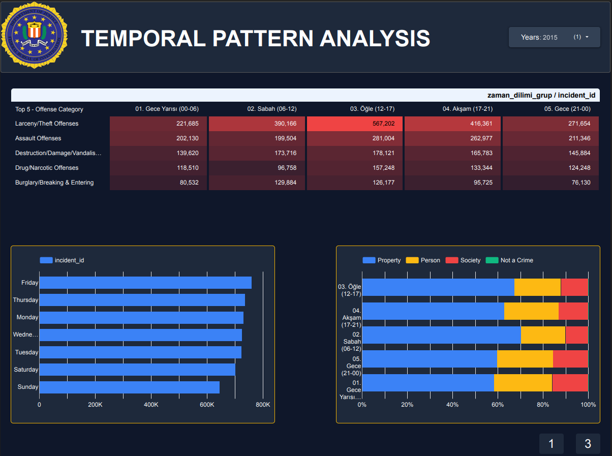
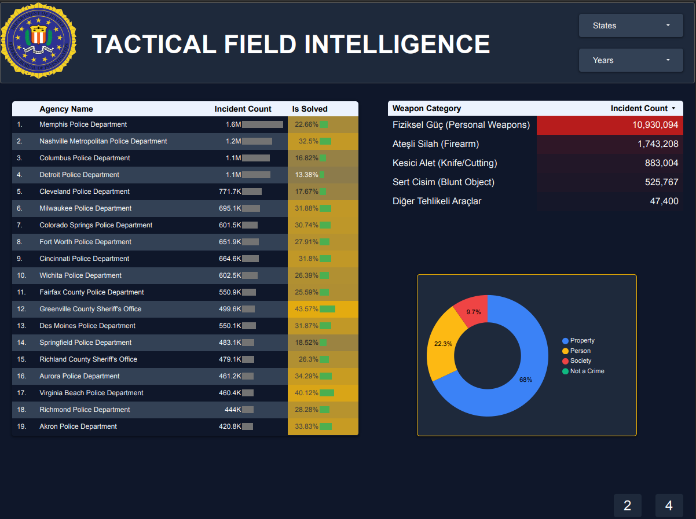
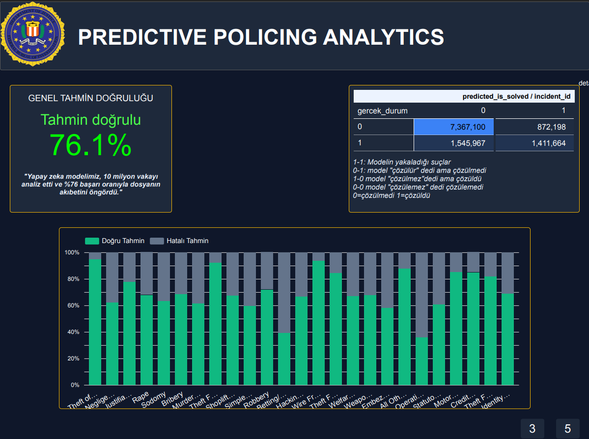
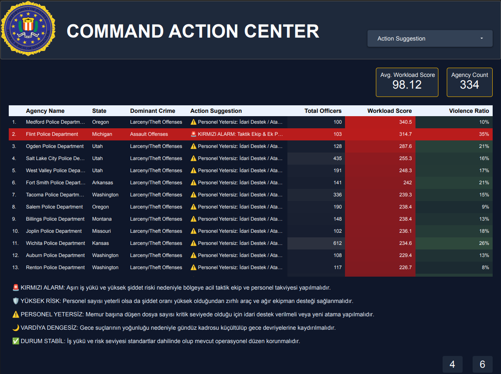

# 🚓 FBI NIBRS Crime Analysis & Predictive Policing Dashboard

## 📌 Proje Hakkında (About the Project)
Bu proje, Amerika Birleşik Devletleri Federal Soruşturma Bürosu (FBI) tarafından sağlanan **National Incident-Based Reporting System (NIBRS)** verilerini kullanarak kapsamlı bir suç analizi, operasyonel iş yükü takibi ve makine öğrenmesi destekli suç tahminleme sistemi geliştirmeyi amaçlamaktadır.

Veri seti, **DoltHub** üzerinden temin edilmiş olup, SQL sorguları ile manipüle edilmiş ve Looker Studio üzerinde interaktif bir dashboard haline getirilmiştir.

Projenin temel amacı:
1.  Suç trendlerini ve mekansal dağılımları analiz etmek.
2.  Polis departmanlarının iş yükünü ve operasyonel açıklarını tespit etmek.
3.  Makine öğrenmesi modelleri ile suçun çözülme ihtimalini (Clearance Rate) tahminlemek.

## 📊 Veri Seti (Dataset)
Kullanılan veri seti, FBI'ın NIBRS sistemine ait ilişkisel veritabanı yapısını içerir.
* **Kaynak:** [DoltHub - FBI NIBRS Repository](https://www.dolthub.com/repositories/dolthub/fbi-nibrs)
* **Kapsam:** Olaylar, Mağdurlar, Failler, Tutuklamalar ve Mülk detayları.
* **Veri Büyüklüğü:** 10M+ olay kaydı ve ilişkisel tablolar.

## 🛠 Kullanılan Teknolojiler (Tech Stack)
* **Veri Ambarı & SQL:** Google BigQuery (Veri işleme ve karmaşık JOIN işlemleri için)
* **Görselleştirme:** Google Looker Studio (Dashboard tasarımı)
* **Veri Analizi:** Python & Pandas
* **Makine Öğrenmesi:** Scikit-Learn (Suç çözümleme tahmini için)

## 📈 Dashboard Özellikleri (Key Features)

### 1. Genel Suç Paneli (Crime Dashboard - Main)
Genel bakış ekranı, toplam suç sayısı, mülk kaybı ve tutuklama oranlarını içerir. Yıllara göre suç trendleri ve eyalet bazlı ısı haritaları (Heatmap) ile stratejik bir özet sunar.

### 2. Zamansal Desen Analizi (Temporal Pattern Analysis)
Suçların günün hangi saatlerinde ve haftanın hangi günlerinde yoğunlaştığını analiz eder.
* **Bulgu:** Hırsızlık suçları öğle saatlerinde artarken, saldırı suçları gece saatlerinde zirve yapmaktadır.

### 3. Taktiksel Saha İstihbaratı (Tactical Field Intelligence)
Polis departmanlarının performansını ve iş yükünü (Workload Score) ölçen özel bir modüldür.
* **Action Suggestion:** Departman bazında "Personel Yetersiz", "Kırmızı Alarm" veya "Durum Stabil" gibi otomatik aksiyon önerileri üretir.

### 4. Tahmine Dayalı Analitik (Predictive Policing Analytics)
Geçmiş veriler kullanılarak eğitilen yapay zeka modeli, bir suç dosyasının çözülüp çözülemeyeceğini tahmin eder.
* **Model Başarısı:** %76.1 Doğruluk Oranı (Accuracy).
* **Confusion Matrix:** Modelin True Positive ve True Negative performansları görselleştirilmiştir.

### 5. Demografik Analiz (Demographic Breakdown)
Mağdur ve faillerin yaş, cinsiyet ve ırk dağılımlarını inceleyerek suçun sosyolojik boyutunu ortaya koyar. Reşit olmayan (Underage) suç oranlarına özel bir odaklanma yapılmıştır.

### 🚨 6. Stratejik Komuta ve Aksiyon Merkezi (Command Action Center)
Veri analitiğini operasyonel kararlara dönüştüren, departman bazlı karar destek ekranı.
* **Reçeteli Analitik (Prescriptive Analytics):** Her polis departmanı için İş Yükü (Workload) ve Şiddet Oranı (Violence Ratio) hesaplanarak; "Kırmızı Alarm", "Personel Yetersiz" veya "Vardiya Dengesiz" gibi **otomatik aksiyon önerileri** üretildi.
* **Risk Skorlama Algoritması:** `(Toplam Suç / Memur Sayısı)` ve `(Şiddet Suçları / Toplam Suç)` formülleriyle oluşturulan dinamik risk matrisi.
* **Görsel Alarm Sistemi:** Kritik seviyedeki departmanların (Örn: Flint PD) anında fark edilmesi için koşullu biçimlendirme (heatmap) ve renk kodlu uyarı sistemi.

## 🧠 Makine Öğrenmesi Metodolojisi
Projede kullanılan tahmin modeli, aşağıdaki özellikleri (features) kullanarak `is_solved` (suç çözüldü mü?) hedefini tahminler:
* Suç Türü (Offense Type)
* Olay Saati ve Günü
* Mekan Türü (Location ID)
* Mağdur/Fail Demografisi
  

---
*Bu proje [İbrahim Sıtkı Aydoğdu](https://www.linkedin.com/in/ibrahim-s%C4%B1tk%C4%B1-aydo%C4%9Fdu-556137341/),
[Senem Yılmaz](https://www.linkedin.com/in/senem-y%C4%B1lmaz-582a00325/),
[Argun Cankat Ergün](https://www.linkedin.com/in/argun-cankat-ergun/),
tarafından geliştirilmiştir.*
